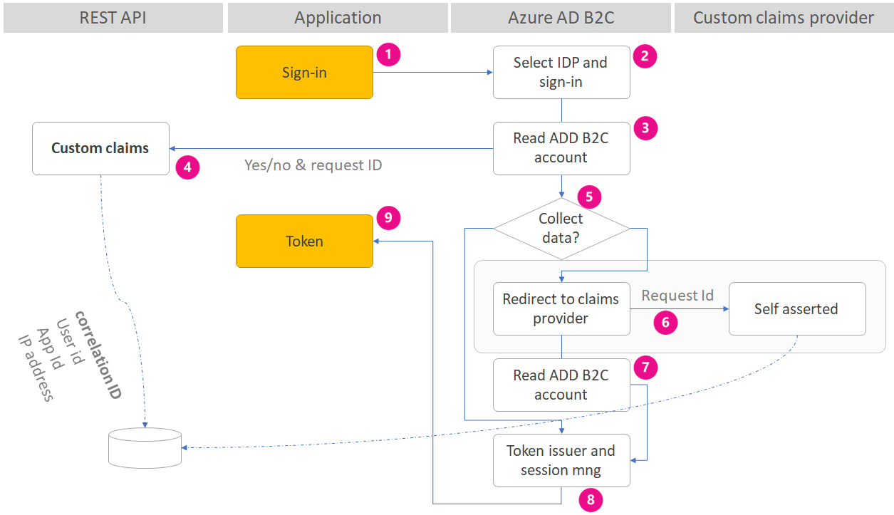

# Azure Active Directory B2C: Custom claims provider
This sample application is a custom OpenId connect claims provider that federates with Azure AD B2C over OIDC protocol. When a user sign-in or sign-up, the custom policy calls a REST API that checks the user profile status and the application ID. If the application requires certain properties that aren't exist in the user profile, the REST API returns an indicator to B2C to redirect the user to the custom claims provider to complete the missing attributes. The REST API response also contains an encrypted unique global ID. This unique global Id is stored in Azure Blob Storage table along with the user object Id.

The solution utilizes the OpenID protocol. Azure AD B2C redirects the user to the custom claims provider (like any OIDC social providers). The request contains also a unique request ID generated by the REST API.

The custom claims provider, decrypt the request Id, checks that the request id exists in Azure Table. Also make sure the request comes from the same IP source.

By calling the Azure Table, the custom claims provider has the user object Id. With the user object Id, the claims provider is able to update the user profile. After user complete the profile editing the custom claims provider removed the entity from Azure Blob storage.

1. User clicks on sign-in and redirect to Azure AD B2C
2. User sign-in or sign-up (with local or social account)
3. Azure AD B2C reads the user profile
4. Azure AD B2C makes a call to the REST API. Sending the user profile claims, correlation ID, user IP address and application Id. The REST API returns back indicator if additional step is required. If yes, the response contains the encrypted request Id.
5. Azure AD B2C checks the indicator
6. If necessary, user is redirected to the custom claims provider
7. Azure AD B2C reads the updated profile
8. Azure AD B2C issues the access token
9. User is redirected back to the relying party application 

## Register your application in your tenant
In this demo, the custom claims provider update the user provide using Graph API. To communicate with the Graph API, you first need to have service account with administrative privileges. In Azure AD, you can do this by registering an application and authenticating to Azure AD. The application credentials are: **Application ID** and **Application Secret**. The application acts as itself, not as a user, to call the Graph API.

In this step, you register your Graph API application in Azure AD. Create application key (Application secret) and set the application with right privileges (write, set password, and delete users).

1. Sign in to the [Azure portal](https://portal.azure.com/).
2. Choose your Azure AD B2C tenant by selecting your account in the top right corner of the page.
3. From left panel, open the **Azure Active Directory** (not the Azure AD B2C). You might need to select **More Services** to find it.
4. Select **App registrations (Preview)**.
5. Select **New application registration**.
6. Follow the prompts and create a new application
    * For **Name**, use **B2CUserMigratioin**.
    * For **Supported account types**, use "Accounts in this organizational directory only (Microsoft only - Single tenant)".
    * Click **Create**
7. Once it is created, select the newly created application **B2CUserMigratioin**.
Select **Properties**, copy the **Application ID**, and save it for later.

### Create application secret
8. Click on **Certificates & secrets** and add new client secret by clicking "New client secret". 
9. Add a description and expiration date and click "Add".
10. Copy the key "Value" for later.

## Custom REST API
Project name: AADB2C.ClaimsProvider.API

### App settings
- **BlobStorageConnectionString** the connection string to Azure Blob Storage.
- **EncryptionKey** Encryption key. The REST API uses this key to encrypt the request Id Azure AD B2C sends to the custom claims provider.

## Claims provider
Project name: AADB2C.ClaimsProvider.UI

### App settings
- **BlobStorageConnectionString** the connection string to Azure Blob Storage
- **CertificateName** The certificate file name, for example, contoso.website.pfx
- **CertificatePassword** Certificate password
- **EncryptionKey** Encryption key. The custom claims provider uses this key to decrypt the request Id Azure AD B2C sends to the claims provider
- **AuthorizedRedirectUri** The authorized redirect Uri. This Uri point to Azure AD B2C OAuth2 endpoint. The custom claims provider checks the redirect_uri with this one, to make sure the redirect is legitimate.
- **Issuer** Token issuer. Make sure you specify the same value in the policy technical profile `ClaimsExchange-OIDC`.
- **Audience** Token audience. Make sure you specify the same value in the policy technical profile `ClaimsExchange-OIDC`.
- **Tenant** Your tenant name. Graph API uses this tenant name
- **ClientId**  Your Azure AD Graph app ID
- **ClientSecret** our Azure AD Graph app secret

## Community Help and Support
Use [Stack Overflow](https://stackoverflow.com/questions/tagged/azure-ad-b2c) to get support from the community. Ask your questions on Stack Overflow first and browse existing issues to see if someone has asked your question before. Make sure that your questions or comments are tagged with [azure-ad-b2c].
If you find a bug in the sample, please raise the issue on [GitHub Issues](https://github.com/azure-ad-b2c/samples/issues).
To provide product feedback, visit the Azure Active Directory B2C [Feedback page](https://feedback.azure.com/forums/169401-azure-active-directory?category_id=160596).
