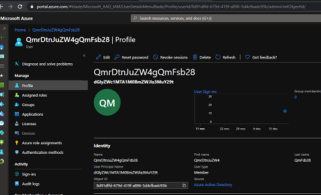
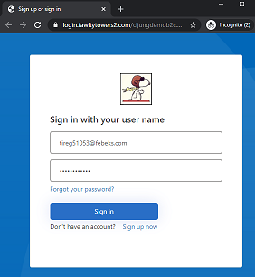

# Encrypted profile
This sample demonstrates a way to encrypt the attributes stored on a user object in Azure AD B2C, including the `signInName`.

## Scenario
In some applications data residency is an issue which requires a user's profile to be stored in a certain country or in a dedicated data center. For this, you have the [remote profile](https://github.com/azure-ad-b2c/samples/tree/master/policies/remote-profile) samples. But in other applications, with tough security requirements, the question is that what you store can not be in clear text. For instance, it can not be readable like in portal.azure.com for IT Admins regardless the appropriate permissions. It must be anonymous and encrypted.

This sample will encrypt a user's profile attributes, like displayName, givenName, etc, so that it is unreadable. A user would look like this in portal.azure.com.



If you use [Microsoft Graph Explorer](https://developer.microsoft.com/en-us/graph/graph-explorer) to query the user object created with this signup policy, the the `signInName` attribute will also be encrypted in order not to reveal the user's the email. 


  

## Encrypting the attributes
The encryption in this sample is done in an Azure Function that is called with B2C's RESTful Provider. In this sample, there are two versions of the Azure Function, where the [run.csx](source-code/run.csx) file contains the implementation just doing base64 encode/decode and where the [run_encrypted.csx file](source-code/run_encrypted.csx) contains the implementation that hashes the `email` with a salt and does symmetric encryption of attributes. The purpose of the simple base64 encode/decode function is to keep it simple and get you going without too much setup. The purpose of the function with encryption is to show how real encryption could be done. If you plan to use the Azure Function with encryption, please see instructions at the bottom for deploying the Azure Function together with Azure Key Valut.

During **signup**, the B2C policy calls it as an REST API to encrypt attrributes like `email, displayName, givenName and surname`. The encrypted values are then persisted to the user object. The `email` value is persisted as a `userid` and not as an `emailAddress`, since the encrypted result does not follow the email syntax anymore. 

What happens during **signin** is that the user enters the email in clear text in the user interface, since that is what he/she knows. The B2C policy then calls the Azure Function to encrypt the email before validating the userid/password.



To decrypt the additional attributes so they can appear in clear text in the JWT token, the Azure Function is called again at the end of the signin user journey to decrypt attributes like displayName, etc. 


## B2C Custom Policy explained

### Signup encryption
During **signup** there are two steps in the UserJourney that first calls the REST API to encrypt the attributes and then (re)writes them. The reason that this is not done in a `ValidationTechnicalProfile` step is that if you plan to extend this and capture more info in secondary UX pages, you need to do it after all user input is captured. It is also worth noting that the (re)write is responsible for removing the `signInNames.emailAddress` and replacing it with `signInNames.userid`. We don't use `signInNames.username` as that has a max length limit of 64 chars while using another name, like `userid` gives us 100 chars to persist. From a functional perspective, it doesn't matter.

```xml
<!-- next 2 steps are only executed during SignUp. It calls the REST API to encrypt and rewrites the persisted values -->
<OrchestrationStep Order="3" Type="ClaimsExchange">
    <Preconditions>
    <Precondition Type="ClaimsExist" ExecuteActionsIf="false">
        <Value>newUser</Value>
        <Action>SkipThisOrchestrationStep</Action>
    </Precondition>
    </Preconditions>
    <ClaimsExchanges>
    <ClaimsExchange Id="REST-Encrypt" TechnicalProfileReferenceId="REST-API-EncodeClaims" />
    </ClaimsExchanges>
</OrchestrationStep>        
<OrchestrationStep Order="4" Type="ClaimsExchange">
    <Preconditions>
    <Precondition Type="ClaimsExist" ExecuteActionsIf="false">
        <Value>newUser</Value>
        <Action>SkipThisOrchestrationStep</Action>
    </Precondition>
    </Preconditions>
    <ClaimsExchanges>
    <ClaimsExchange Id="Write-Encrypt" TechnicalProfileReferenceId="AAD-UserWriteEncryptedUsingObjectId" />
    </ClaimsExchanges>
</OrchestrationStep>
```

### Signin encryption / decryption
During **signin** we must take what the user typed in the UX and encrypt it before attepting to authenticate the local account, as the email doesn't work as a unique identifier for the user anymore. Therefor, the TechinalProfile `SelfAsserted-LocalAccountSignin-Email` is modified in the [TrustFrameworkExtensions.xml](policies/TrustFrameworkExtensions.xml) file to include a call to the REST API. It will pass what the user typed in the `signInName` and get back a claim called `emailEncrypted`.

```xml
<!-- before validating the userid/password, encrypt what the user entered and use that -->
<TechnicalProfile Id="SelfAsserted-LocalAccountSignin-Email">
    <Metadata>
    <Item Key="setting.operatingMode">username</Item>
    </Metadata>
    <ValidationTechnicalProfiles>
    <ValidationTechnicalProfile ReferenceId="REST-API-EncodeClaims" />
    <ValidationTechnicalProfile ReferenceId="login-NonInteractive" />
    </ValidationTechnicalProfiles>
</TechnicalProfile>
```

Then, we must modify `login-NonInteractive` to use `emailEncrypted` as the username. ***Note*** that you must also edit the [TrustFrameworkBase.xml](policies/TrustFrameworkBase.xml) file to remove the similar line where is sends `signInName` as username as it will not work otherwise. 

```xml
<TechnicalProfile Id="login-NonInteractive">
    <Metadata>
    <Item Key="client_id">...guid...</Item>
    <Item Key="IdTokenAudience">...guid...</Item>
    </Metadata>
    <InputClaims>
    <InputClaim ClaimTypeReferenceId="client_id" DefaultValue="...guid..." />
    <InputClaim ClaimTypeReferenceId="resource_id" PartnerClaimType="resource" DefaultValue="...guid..." />
    <InputClaim ClaimTypeReferenceId="emailEncrypted" PartnerClaimType="username" Required="true" />
    </InputClaims>
</TechnicalProfile>
```

At the end of the signin UserJourney, there is a orchestration step that decrypts the additional attributes, like displayName, since you want these attributes in clear text in the JWT token. To keep it simple in this sample, it is the same Azure Function that has the responsibility of also decrypting values and the REST API is passed a flag `restApiOperation` to signal if it is encryption or decryption it should perform. 

```xml
<!-- the next step is only executed during Signin. It decrypts displayName, etc, so you can get them in clear text in the JWT -->
<OrchestrationStep Order="6" Type="ClaimsExchange">
    <Preconditions>
    <Precondition Type="ClaimsExist" ExecuteActionsIf="true">
        <Value>newUser</Value>
        <Action>SkipThisOrchestrationStep</Action>
    </Precondition>
    </Preconditions>
    <ClaimsExchanges>
    <ClaimsExchange Id="Decrypt-at-Signin" TechnicalProfileReferenceId="REST-API-DecodeClaims" />
    </ClaimsExchanges>
</OrchestrationStep>
```

## Azure Function with encryption - how it works
The Azure Function [run_encrypted.csx](source-code/run_encrypted.csx) does the following

1. Gets the parameters signInName, email, displayName, givenName and surName.
1. Looks for the hash salt and AES Key + IV as Environment Variables.
1. If there are no environment variables, calls Azure Key Vault to obtain the secrets and sets them as Environment Variables. This serves as some basic way of caching as we don't need to obtain them again until the service is restarted.
1. If operation is encoding, hash the signInName/email with the salt obtained from Azure Key Vault and encrypt the other attributes.
1. If operation is decoding, do nothing with the signInName/email and decrypt the other attributes.

## Azure Function and Azure Key Vault configuration
In order to use the Azure Function [run_encrypted.csx](source-code/run_encrypted.csx) that implements real encryption, you need to do the following steps.

### Azure Function - part 1
1. Deploy and Azure Function with OS=Windows and Runtime=.Net Core 3.1 with type=HttpTrigger and give it a name like `EncryptClaims`. Set the Authorization level to `Anonymous`.
1. Copy the code in [run_encrypted.csx](source-code/run_encrypted.csx) and paste it over the code in `run.csx`.
1. Do a `Test/Run` of the function passing a Body of `{ "restApiOperation": "generate" }` and copy the response output to somewhere since we will add these values as Azure Key Vault secrets. This step helps you to generate the hash salt and AES Key and IV.

### Azure AD Service Principal for accessing Azure Key Vault
The hast salt and AES Key and IV (Initialization Vector) are stored in Azure Key Vault. In order for the Azure Function to retrieve these values, you need to do an App Registration in the Azure AD that protects the Azure Key Vault you plan to use (ie, do NOT register this app in the B2C tenant). The documentation is available [here](https://docs.microsoft.com/en-us/azure/key-vault/general/authentication) but you just need to register an application and create a secret. Make sure you copy and save `tenantid` of your Azure AD (not the B2C tenant), the `AppID` and the secret as we need to configure these values in the Azure Function - part 2.

### Azure Key Vault

1. [Deploy an Azure Key Vault](https://docs.microsoft.com/en-us/azure/key-vault/general/quick-create-portal) in an Azure subscription if you don't have one.
1. Under `Access policies`, select `+Add Access Policy`.
    1. Key permissions = you don't need to select anything
    1. Secret permissions = select `Get, List`
    1. Select principal = Search for you service principal via your `AppID` guid
1. Under `Secrets`, select `+Generate/Import`.
    1. Upload options = Manual
    1. Name = `B2CEncryptionSalt` 
    1. Value = the value for B2CEncryptionSalt you saved in above step (Azure Function - part 1). This should be a base64 string
1. Under `Secrets`, select `+Generate/Import`.
    1. Upload options = Manual
    1. Name = `B2CAesKeyIV` 
    1. Value = the value for B2CAesKeyIV you saved in above step (Azure Function - part 1). This should be two base64 strings separated by a "."

### Azure Function - part 2
Last part is to add some configuration for your Azure Function. Find `Configuration` in the menu and do `+New application settings` once for each setting mentioned below.

1. KV_TENANTID = the `tenantid` of your Azure AD (not the B2C tenant)
1. KV_CLIENTID = the `AppID` of your Azure AD service principal you created above
1. KV_CLIENTSECRET = the `secret` of your Azure AD service principal you created above
1. KV_NAME = the `Name` of your Azure Key Vault 

### Edit TrustFrameworkExtensions.xml 
Edit the TrustFrameworkExtensions.xml file so that the `ServiceUrl` points to your new Azure Function. Then upload the policies again.

## Community Help and Support
Use [Stack Overflow](https://stackoverflow.com/questions/tagged/azure-ad-b2c) to get support from the community. Ask your questions on Stack Overflow first and browse existing issues to see if someone has asked your question before. Make sure that your questions or comments are tagged with [azure-ad-b2c].
If you find a bug in the sample, please raise the issue on [GitHub Issues](https://github.com/azure-ad-b2c/samples/issues).
To provide product feedback, visit the Azure Active Directory B2C [Feedback page](https://feedback.azure.com/forums/169401-azure-active-directory?category_id=160596).

## Notes
This sample policy is based on [SocialAndLocalAccounts starter pack](https://github.com/Azure-Samples/active-directory-b2c-custom-policy-starterpack/tree/master/SocialAndLocalAccounts). All changes are marked with **Demo:** comment inside the policy XML files. Make the necessary changes in the **Demo action required** sections. 