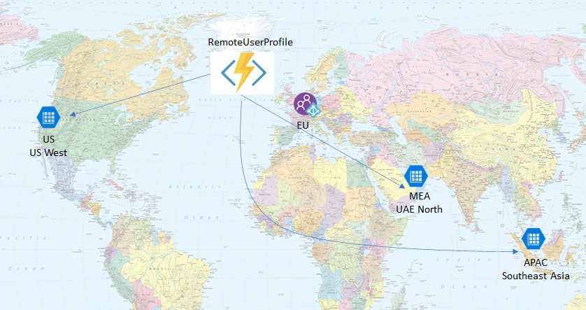
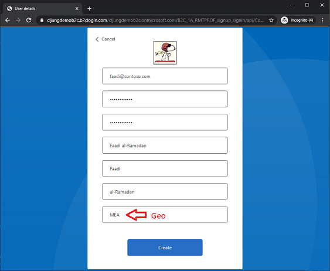
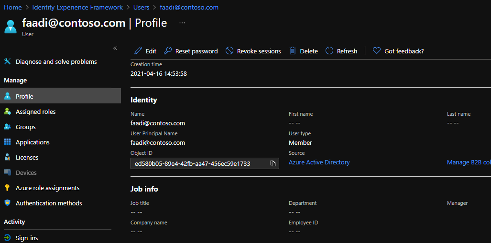
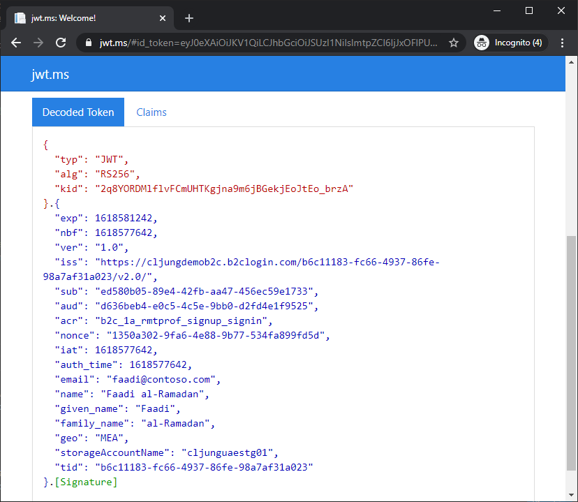

# Remote Profile with Geo-based Storage
This sample demonstrates storing user profile either in B2C directory or in different Azure Table Storages based in user geography setting. 

## Scenario
In some applications data residency is important and where consumer profiles are store must follow local laws and regulations. The solution in this B2C policy configuration is to store the user profile in the B2C directory if the user's geography matches where the B2C tenant is deployed. The policy is configured to treat `EU` as geography where it is ok to store the profile in the B2C directory. If the user's geo value is not `EU`, then the profile is stored remotely via calling a REST API. The geo value is passed to the REST API and it stores the user profiles in different Azure Table Storage around the world according to your configuration based on the geo value.



## Geo-based Storage

The way the Azure Function determinds which Azure Table Storage to use for the remote profile is very simple in this sample. You need to configure a connection string for each Azure Storage you deploy around the world. 

```csharp
string connectionString = Environment.GetEnvironmentVariable("STORAGE_CONNECTSTRING_" + geo);
```

Your `Configuration` for your Azure Function should then contain something like below. To extend it to more regions is simply a matter of deploying more storage and adding the configuraiton setting.

```json
  {
    "name": "STORAGE_CONNECTSTRING_APAC",
    "value": "DefaultEndpointsProtocol=https;AccountName=apacstg01;AccountKey=...;EndpointSuffix=core.windows.net",
    "slotSetting": false
  },
  {
    "name": "STORAGE_CONNECTSTRING_MEA",
    "value": "DefaultEndpointsProtocol=https;AccountName=uaestg01;AccountKey=...;EndpointSuffix=core.windows.net",
    "slotSetting": false
  },
  {
    "name": "STORAGE_CONNECTSTRING_US",
    "value": "DefaultEndpointsProtocol=https;AccountName=usstg01;AccountKey=...;EndpointSuffix=core.windows.net",
    "slotSetting": false
  },

```

## B2C Custom Policy explained

### Signup 

During signup, the sample policy asks the user for geo value. There is no error checking here and you must enter an existing value for your configuration, like `EU`, `US`, `APAC` or `MEA`. 



During **signup**, a modified TechnicalProfile called `LocalAccountSignUpWithLogonEmail-RemoteProfile` handles the creation of the user. The `ValidationTechnicalProfiles` for this TechnicalProfile has these three steps. The first `AAD-UserWriteUsingLogonEmail` is executed if the user's geo is `EU`, which means we can store the profile data in the B2C directory. The second two, `AAD-UserWriteUsingLogonEmail-RemoteProfile` and `REST-SignUpOrEditProfile`, are for when the user needs to be stored remotely. In that case we first write limited data to the B2C tenant and then call the REST API to store the rest in Azure Table Storage. 

```xml
<ValidationTechnicalProfiles>
<!-- If user profile is in B2C directory, then execute this VTP (geo=EU is stored in B2C tenant ) -->
<ValidationTechnicalProfile ReferenceId="AAD-UserWriteUsingLogonEmail" >
    <Preconditions>
    <Precondition Type="ClaimEquals" ExecuteActionsIf="false">
        <Value>geo</Value>
        <Value>EU</Value>
        <Action>SkipThisValidationTechnicalProfile</Action>
    </Precondition>
    </Preconditions>
</ValidationTechnicalProfile>
<!-- If user profile is stored remotely, then execute this VTP (geo=EU is stored in B2C tenant ) -->
<ValidationTechnicalProfile ReferenceId="AAD-UserWriteUsingLogonEmail-RemoteProfile" >
    <Preconditions>
    <Precondition Type="ClaimEquals" ExecuteActionsIf="true">
        <Value>geo</Value>
        <Value>EU</Value>
        <Action>SkipThisValidationTechnicalProfile</Action>
    </Precondition>
    </Preconditions>
</ValidationTechnicalProfile>
<!-- If user profile is stored remotely, then execute this VTP (geo=EU is stored in B2C tenant ) -->
<ValidationTechnicalProfile ReferenceId="REST-SignUpOrEditProfile">
    <Preconditions>
    <Precondition Type="ClaimEquals" ExecuteActionsIf="true">
        <Value>geo</Value>
        <Value>EU</Value>
        <Action>SkipThisValidationTechnicalProfile</Action>
    </Precondition>
    </Preconditions>
</ValidationTechnicalProfile>
</ValidationTechnicalProfiles>
```

For a non `EU` user, you only see the user's email as a value stored in the B2C directory. 



For a non `EU` user, you see the rest of the user's profile in table storage.


### Signin 
During **signin**, the policy reads the extension attribute `extension_geo` to determind where the user profile is stored. If it is `EU`, we have loaded profile and are done. 

```xml
<!-- add reading of extension_Geo attribute when we read a user object -->
<TechnicalProfile Id="AAD-UserReadUsingObjectId">
    <OutputClaims>
    <!-- Optional claims -->
    <OutputClaim ClaimTypeReferenceId="geo" PartnerClaimType="extension_Geo" />
    </OutputClaims>
</TechnicalProfile>
```

If geo isn't `EU`, then we need to retrieve the user's profile from remote storage using the REST API.

```xml
<!-- If user profile is stored remotely, then retrieve it with a REST API -->
<OrchestrationStep Order="4" Type="ClaimsExchange">
    <Preconditions>
    <Precondition Type="ClaimsExist" ExecuteActionsIf="false">
        <Value>geo</Value>
        <Action>SkipThisOrchestrationStep</Action>
    </Precondition>
    <Precondition Type="ClaimEquals" ExecuteActionsIf="true">
        <Value>geo</Value>
        <Value>EU</Value>
        <Action>SkipThisOrchestrationStep</Action>
    </Precondition>
    </Preconditions>
    <ClaimsExchanges>
    <ClaimsExchange Id="RESTSignIn" TechnicalProfileReferenceId="REST-SignIn" />
    </ClaimsExchanges>
</OrchestrationStep>
```
The sample id_token contains the `geo` value as well as the name of the `storageAccountName` so you can see where it was retrieved from.



### Edit before deploying policies

- change all ***yourtenant***.onmicrosoft.com to your B2C tenant name.
- Edit the TrustFrameworkExtensions-RemoteProfile.xml file so that the `ServiceUrl` points to your new Azure Function. 

The `TrustFrameworkExtensions-RemoteProfile.xml` file is designed to inherit from an already existing `TrustFrameworkExtensions.xml` to avoid having to update AppIDs for IdentityExperienceFramework and ProxyIdentityExperienceFramework apps. Make sure that file has configuration set for handling extension attributes. It should look like below:

```xml
<ClaimsProvider>
    <DisplayName>Azure Active Directory</DisplayName>
    <TechnicalProfiles>
        <TechnicalProfile Id="AAD-Common">
            <Metadata>
                <!--Insert b2c-extensions-app application ID here, for example: 11111111-1111-1111-1111-111111111111-->
                <Item Key="ClientId">11111111-1111-1111-1111-111111111111</Item>
                <!--Insert b2c-extensions-app application ObjectId here, for example: 22222222-2222-2222-2222-222222222222-->
                <Item Key="ApplicationObjectId">22222222-2222-2222-2222-222222222222</Item>
            </Metadata>
        </TechnicalProfile>
    </TechnicalProfiles>
</ClaimsProvider>
```

## Live version
It is available to [test a live version](https://login.fawltytowers2.com/cljungdemob2c.onmicrosoft.com/B2C_1A_RMTPROF_signup_signin/oauth2/v2.0/authorize?client_id=d636beb4-e0c5-4c5e-9bb0-d2fd4e1f9525&nonce=1350a302-9fa6-4e88-9b77-534fa899fd5d&redirect_uri=https%3A%2F%2Fjwt.ms&scope=openid&response_type=id_token&prompt=login&disable_cache=true). There is no email verification during signup, so you can enter whatever email address you prefer. You must select a geo value from this list [ `EU`, `US`, `APAC`, `MEA` ].

If you have tested the live version and want to remove your account, we have provide [the ability to delete your account.](https://login.fawltytowers2.com/cljungdemob2c.onmicrosoft.com/B2C_1A_delete_my_account/oauth2/v2.0/authorize?client_id=d636beb4-e0c5-4c5e-9bb0-d2fd4e1f9525&nonce=defaultNounce&redirect_uri=https%3A%2F%2Fjwt.ms&scope=openid&response_type=id_token&prompt=login&disable_cache=true).

## Community Help and Support
Use [Stack Overflow](https://stackoverflow.com/questions/tagged/azure-ad-b2c) to get support from the community. Ask your questions on Stack Overflow first and browse existing issues to see if someone has asked your question before. Make sure that your questions or comments are tagged with [azure-ad-b2c].
If you find a bug in the sample, please raise the issue on [GitHub Issues](https://github.com/azure-ad-b2c/samples/issues).
To provide product feedback, visit the Azure Active Directory B2C [Feedback page](https://feedback.azure.com/forums/169401-azure-active-directory?category_id=160596).

## Notes
This sample policy is based on [SocialAndLocalAccounts starter pack](https://github.com/Azure-Samples/active-directory-b2c-custom-policy-starterpack/tree/master/SocialAndLocalAccounts). All changes are marked with **Demo:** comment inside the policy XML files. Make the necessary changes in the **Demo action required** sections. 