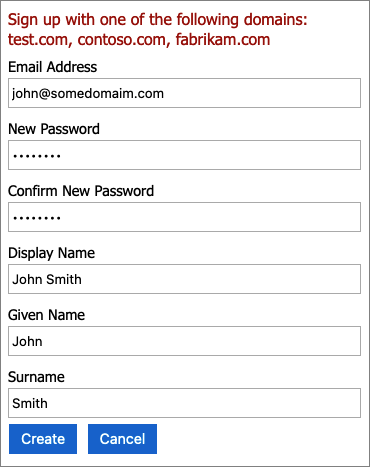

# Azure AD B2C: Sign-up with a allow-listed domain list

## Live demo

To test the policy, follow these steps:

1. Run the [B2C_1A_Demo_SignUpSignIn_DomainAllowlist](https://b2clivedemo.b2clogin.com/b2clivedemo.onmicrosoft.com/B2C_1A_Demo_SignUpSignIn_DomainAllowlist/oauth2/v2.0/authorize?client_id=cfaf887b-a9db-4b44-ac47-5efff4e2902c&nonce=defaultNonce&redirect_uri=https://jwt.ms&scope=openid&response_type=id_token&prompt=login) policy.
1. Select the *Sign-up now* link.
1. In the email field type any email address except @outlook.com, @live.com, or @gmail. For example type **david@fabrikam.com**, or **emily@contoso.com**. Then select *Send verification code*. You should get the following error message: *Please enter a email address from one of the following domains: outlook.com, live.com, or gmail.com.*.
1. Change the email address to one of the allowed domains @outlook.com or @outlook.com, @live.com, or @gmail. This time you will be able to send the verification code.

## How it works

The *email* claim is configured with a regular expression restriction. The error message is configure in the localization part of the policy.

## Scenario

This policy demonstrates how to validate the email address domain name against a list of allowed domains.

> Note:  This sample policy is based on [SocialAndLocalAccounts starter pack](https://github.com/Azure-Samples/active-directory-b2c-custom-policy-starterpack/tree/master/SocialAndLocalAccounts). All changes are marked with **Demo:** comment inside the policy XML files. Make the necessary changes in the **Demo action required** sections.
